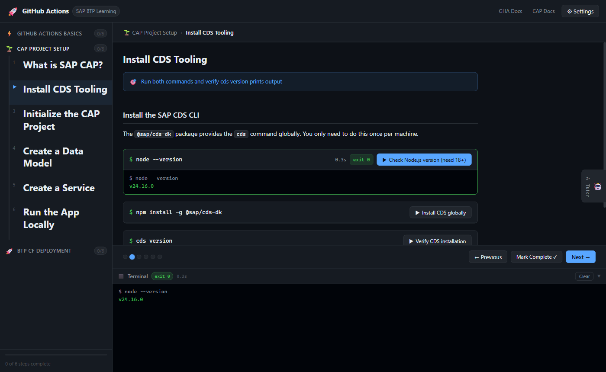
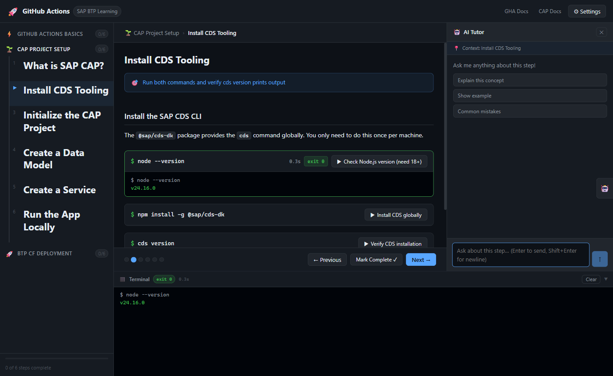
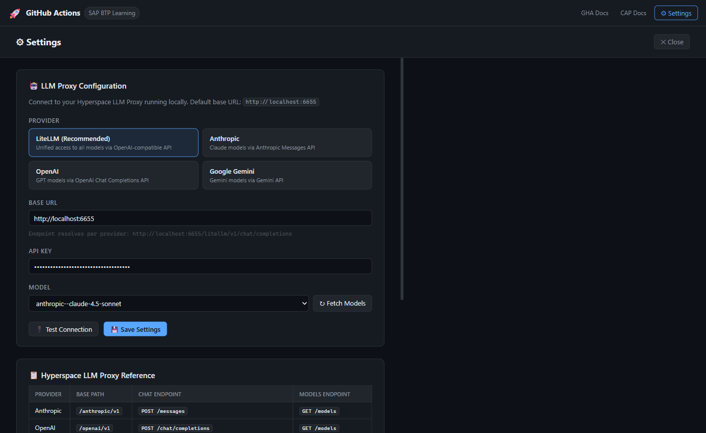

# GitHub Actions + SAP BTP Learning App

An **interactive, browser-based learning environment** for mastering GitHub Actions in the context of SAP BTP (Business Technology Platform) and CAP (Cloud Application Programming Model).

Click through structured lessons, run real shell commands with a single button, edit source files directly in a Monaco editor, and ask an AI tutor questions — all from one local web app.

---

## Screenshots

### Lesson view with terminal output


### AI Tutor chat panel


### Settings — LLM proxy configuration


---

## Features

| Feature | Details |
|---|---|
| **6 learning modules** | 38 steps across GHA Basics, CAP Setup, BTP Deployment, GHA Advanced, CAP Advanced, Monitoring |
| **Click-to-run commands** | Commands stream live output to the terminal; ✏ edit before running to change any hardcoded value |
| **■ Stop button** | Kill any long-running process (e.g. `cds watch`, `cf logs`) instantly |
| **Monaco code editor** | Edit files in-browser with syntax highlighting; real-time reload when file changes externally |
| **AI Tutor** | Chat with an LLM; AI can write/update files directly from the chat |
| **File Explorer** | Sidebar tree of all project files — click any file to open it in Monaco |
| **GitHub Actions status** | Live workflow run status, jobs and steps in the sidebar (SSE polling) |
| **Flexible terminal** | Dock bottom or right, drag to resize, ad-hoc commands with history, Ctrl+C stop |
| **Project directory picker** | Choose where to create your CAP project; all commands run inside it |
| **Progress tracking** | Completed steps persisted to `~/.githubActionsCAP-progress.json` |

---

## Tech Stack

```
app/
├── backend/     Express + Node.js
│   └── src/
│       ├── routes/execute.js    ← SSE command runner (kills whole process tree on stop)
│       ├── routes/files.js      ← read/write/watch project files, recursive tree listing
│       ├── routes/github.js     ← GitHub Actions API proxy (runs, jobs, SSE watch)
│       ├── routes/llm.js        ← LLM proxy with write_file tool support
│       ├── routes/settings.js   ← persist LLM + GitHub config
│       └── routes/progress.js   ← persist lesson progress
└── frontend/    React 18 + Vite + TypeScript
    └── src/
        ├── lessons/             ← 6 lesson modules (TypeScript)
        ├── components/
        │   ├── layout/          ← Header, Sidebar, FileExplorer, FileEditorOverlay
        │   ├── lesson/          ← LessonShell, RunBlock, EditorBlock, DirPickerBlock
        │   ├── terminal/        ← TerminalPanel (bottom/right dock, resizable)
        │   ├── ai/              ← AIChatPanel (resizable, file-write tool)
        │   ├── github/          ← GHAStatusPanel (live run status)
        │   └── settings/        ← SettingsPage (LLM + GitHub config)
        ├── context/             ← AppStateContext, SettingsContext
        └── hooks/               ← useSSE, useLLMChat
```

---

## Prerequisites

- **Node.js 18+** (tested on v24)
- **Git for Windows** (provides `bash` — required for command execution on Windows)
- **[Hyperspace LLM Proxy](http://localhost:6655)** running locally (optional — needed for AI Tutor only)

---

## Getting Started

### 1. Clone

```bash
git clone https://github.com/skalmodiya/github-actions-cap-learning.git
cd github-actions-cap-learning
```

### 2. Install dependencies

```bash
cd app/backend && npm install
cd ../frontend && npm install
```

### 3. Start

**Terminal 1 — Backend:**
```bash
cd app/backend
node src/index.js
# Starts on port 19260 (or set PORT env var)
```

**Terminal 2 — Frontend:**
```bash
cd app/frontend
npm run dev
# Opens on http://localhost:8765 (or next available port)
```

### 4. Open the app

Navigate to the URL shown by Vite (e.g. `http://localhost:8765`).

---

## Learning Modules

### ⚡ Module 1 — GitHub Actions Basics (6 steps)
| Step | What you learn |
|---|---|
| What is GitHub Actions? | CI/CD concepts, runners, triggers |
| Workflow file anatomy | YAML structure — `on`, `jobs`, `steps` |
| Triggers | `push`, `pull_request`, `workflow_dispatch`, `schedule` |
| Jobs & Steps | Runner selection, `needs:`, `uses:` vs `run:` |
| Secrets | Storing BTP credentials, `${{ secrets.X }}` |
| Your first workflow | Create `.github/workflows/hello.yml` with Monaco editor |

### 🌱 Module 2 — CAP Project Setup (6 steps)
| Step | What you learn |
|---|---|
| What is SAP CAP? | Entities, services, OData, HDI |
| Install CDS tooling | `npm install -g @sap/cds-dk`, `cds version` |
| Initialize the project | `cds init .` (structure) + `cds add nodejs` (package.json) |
| Create a data model | Edit `db/schema.cds` — Books & Authors entities |
| Create a service | Edit `srv/catalog-service.cds` — OData endpoint |
| Run locally | `cds watch` with SQLite in-memory database |

> **CDS v8+ note:** `cds init .` no longer generates `package.json`. Run `cds add nodejs` afterward to create it with `@sap/cds ^9`.

### 🚀 Module 3 — BTP CF Deployment (6 steps)
| Step | What you learn |
|---|---|
| BTP deployment overview | MTA format, CF orgs/spaces, deploy flow |
| Install CF CLI & MBT | `cf version`, `npm install -g mbt` |
| Create mta.yaml | MTA descriptor — modules, resources, bindings |
| Build the MTAR | `cds build --production` + `mbt build` |
| Login to Cloud Foundry | `cf login` with username/password or SSO; `cf target` to switch org/space |
| GitHub Actions deploy workflow | Full CI/CD pipeline in `.github/workflows/deploy.yml` |

### 🔬 Module 4 — GHA Advanced Patterns (8 steps)
| Step | What you learn |
|---|---|
| Reusable Workflows | `workflow_call` trigger, caller/callee pattern, inputs & secrets |
| Matrix Builds | Parallel jobs across Node versions and OSes, `include`/`exclude` |
| Environments & Approvals | Protection rules, required reviewers, deployment gates |
| OIDC — Keyless Auth | Federated identity, no stored CF credentials, `id-token: write` |
| PR Validation Workflow | `cds compile` check, lint, tests on every pull request |
| Caching Dependencies | `actions/cache` for npm, mbt, cds-dk — 30–60s faster builds |
| Custom Composite Actions | Reusable `.github/actions/` with typed inputs/outputs |
| Debugging Failed Runs | `ACTIONS_STEP_DEBUG`, `gh run view --log-failed`, tmate SSH |

### 🔐 Module 5 — CAP Advanced Features (7 steps)
| Step | What you learn |
|---|---|
| XSUAA Authentication | OAuth2/OIDC on BTP, `xs-security.json`, scopes, role-templates |
| Securing Services | `@requires`, `@restrict`, instance-level security with `where:` |
| HANA Cloud | `cds add hana`, HDI containers, `mta.yaml` HDI resource |
| CDS Fiori Annotations | `@UI.LineItem`, `@UI.HeaderInfo`, `@Capabilities`, Fiori elements preview |
| Remote Services & Destinations | `cds.requires` config, `cds import`, Destination service |
| CAP Plugins | Audit logging, notifications, attachments via `@cap-js/*` packages |
| Multitenancy with MTX | `cds add mtx`, `@sap/cds-mtxs`, tenant isolation |

### 📊 Module 6 — Monitoring & Troubleshooting (6 steps)
| Step | What you learn |
|---|---|
| CF Application Logs | `cf logs --recent` vs live streaming; reading APP/RTR/STG sources |
| CF Events & Crash Analysis | `cf events`, `cf app`, crash reasons (OOM, startup timeout) |
| CF Services Status | `cf services`, `cf service`, `cf env`, reading VCAP_SERVICES |
| GitHub Actions Logs (gh CLI) | `gh run list`, `gh run view --log-failed`, `gh run rerun --failed-only` |
| Common Failure Patterns | 8 common BTP deployment errors with causes and fixes |
| Health Checks & Scaling | `cf set-health-check`, `cf scale`, rolling restarts |

---

## AI Tutor

The AI Tutor connects to your local **Hyperspace LLM Proxy** and can both answer questions and **write files directly**.

### Setup
1. Click **⚙ Settings** in the top-right corner
2. Select **Provider** (LiteLLM recommended)
3. Confirm **Base URL** is `http://localhost:6655`
4. Click **↻ Fetch Models**, select a model
5. Click **💾 Save Settings**
6. Click **🤖 AI Tutor** on any lesson step

### AI File Editing
Ask the tutor to update files directly:
> *"Update db/schema.cds to use UUID keys and add a description field"*

The AI uses a `write_file` tool — the file is written to disk and the Monaco editor reloads instantly.

### Supported Providers

| Provider | Base URL | Chat Endpoint |
|---|---|---|
| LiteLLM | `http://localhost:6655/litellm/v1` | `POST /chat/completions` |
| Anthropic | `http://localhost:6655/anthropic/v1` | `POST /messages` |
| OpenAI | `http://localhost:6655/openai/v1` | `POST /chat/completions` |
| Gemini | `http://localhost:6655/gemini` | `POST /v1beta/models/{model}:generateContent` |

---

## GitHub Actions Live Status

Connect your repo to see live workflow run status in the sidebar.

1. Go to **⚙ Settings → GitHub Integration**
2. Create a PAT at **GitHub → Settings → Developer settings → Personal access tokens** with `repo` + `workflow` scopes
3. Enter your **token**, **owner** (GitHub username), and **repo name**
4. Click **🔌 Test Connection**

The **⚡ GitHub Actions** panel in the sidebar shows:
- Run list with ✓/✗/⟳ status, branch, commit SHA, duration
- Expand any run to see jobs and individual step status
- Auto-refreshes via SSE every 20s while runs are in progress
- **Open in GitHub ↗** link for full log access

---

## Terminal Features

| Feature | How |
|---|---|
| **Ad-hoc commands** | Type in the `$` input bar at the bottom, press Enter |
| **Command history** | ↑/↓ arrows to navigate last 50 commands |
| **Stop running process** | Click **■ Stop** or press **Ctrl+C** in the input |
| **Dock position** | Click **⬇** (bottom) or **➡** (right panel) in toolbar |
| **Resize** | Drag the top/left edge handle; **⤢** resets to default size |
| **Clear output** | Click **Clear** or press **Ctrl+L** |
| **Working directory** | `cwd:` row shows active project dir, editable for one-off paths |

---

## Backend API Reference

| Endpoint | Method | Description |
|---|---|---|
| `/api/health` | GET | Health check — returns `{ ok, cwd, shell }` |
| `/api/execute` | POST `{ command, cwd? }` | Run command; SSE `stdout`/`stderr`/`done`; disconnect kills process tree |
| `/api/file` | GET `?path=` | Read a file |
| `/api/file` | POST `{ path, content }` | Write a file (mkdir -p included) |
| `/api/ls` | GET `?path=&recursive=true&depth=N` | List directory (flat or recursive tree) |
| `/api/watch` | GET `?path=` | SSE stream — emits `changed` event on file modification |
| `/api/settings` | GET / POST | Read/write `~/.githubActionsCAP-settings.json` |
| `/api/progress` | GET / POST | Read/write `~/.githubActionsCAP-progress.json` |
| `/api/llm/chat` | POST `{ messages, systemPrompt, projectDir? }` | Streaming chat with `write_file` tool support |
| `/api/llm/models` | GET | Fetch model list from configured provider |
| `/api/github/runs` | GET `?owner=&repo=` | List recent workflow runs |
| `/api/github/run/:id/jobs` | GET `?owner=&repo=` | List jobs and steps for a run |
| `/api/github/test` | GET `?owner=&repo=` | Test GitHub token and return repo info |
| `/api/github/watch` | GET `?owner=&repo=` | SSE — emits `update` when run status changes (polls every 20s) |

---

## File Explorer

The **FILES** panel in the sidebar shows a live tree of your project files.

- **Expand/collapse** directories by clicking them
- **Click any file** → opens it in a full Monaco editor overlay (with Save and close)
- **↺ Refresh** button reloads the tree (also auto-refreshes when AI tutor writes files)
- Automatically excludes: `node_modules/`, `gen/`, `mta_archives/`, `.git/`, `app/` (the learning app itself)

---

## Adding a New Lesson Module

1. Create `app/frontend/src/lessons/07-your-topic.ts`
2. Export a `Module` object:
```typescript
import type { Module } from '../types'
export const myModule: Module = {
  id: '07-your-topic',
  title: 'Your Topic',
  icon: '🔧',
  description: '...',
  steps: [{
    id: '07-step-1',
    title: 'First Step',
    contextHints: ['keyword1', 'keyword2'],
    blocks: [
      { kind: 'markdown', content: `## Explanation...` },
      { kind: 'run', label: 'Run something', command: 'echo hello' },
      { kind: 'editor', path: 'myfile.yml', defaultContent: '# starter content' },
      { kind: 'dirpicker', label: 'Choose project folder' },
    ],
  }],
}
```
3. Register in `app/frontend/src/lessons/index.ts`:
```typescript
import { myModule } from './07-your-topic'
export const MODULE_LIST = [...existing, myModule]
```

### Block types

| Kind | Purpose |
|---|---|
| `markdown` | Explanatory text with full markdown + code highlighting |
| `code` | Syntax-highlighted read-only code snippet |
| `run` | Click-to-run command with ✏ edit, streaming output, ■ stop |
| `editor` | Monaco editor for a specific file (read/write/watch) |
| `dirpicker` | Project folder selector (sets `cwd` for all run/editor blocks with `useProjectDir: true`) |

---

## Windows Notes

Command execution uses **Git for Windows bash** (`C:\Program Files\Git\bin\bash.exe`), resolved automatically at backend startup. All lesson commands are bash — `npm`, `cds`, `cf`, `mbt`, and `git` must be on your Windows PATH.

Settings and progress live in your home directory and survive project resets:
- `~/.githubActionsCAP-settings.json` — LLM proxy + GitHub config
- `~/.githubActionsCAP-progress.json` — completed lesson steps

Terminal layout (position + size) is saved to `localStorage`.

---

## License

MIT
